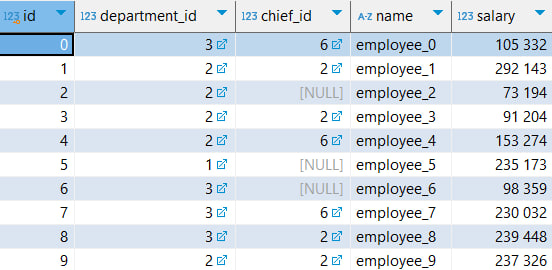

## Task3
Структура БД для хранения фигур:

Пример отображения сгенерированных фигур на поле:

## Task1
Структура БД:

Пример сгенерированных данных

Результат запросов

## Для запуска лучше использовать env
`python -m venv env` - создание виртуального окружения

`env\Scripts\activate` - запуск виртуального окружения

`pip install -r requirements.txt` - установка зависимостей

`cd task<n>`, `python main.py` - запуск конкретного задания

